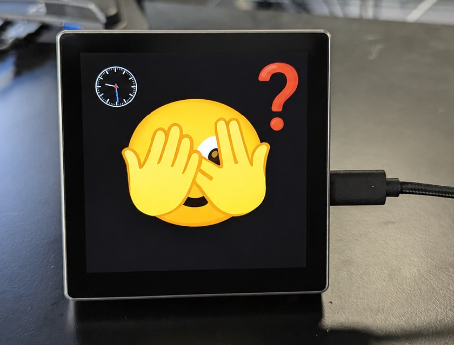

# AI Agent Persona Display

Physical emoji display for an AI agent — a tiny screen that shows what the
agent is doing through expressive emoji faces.  Runs on an ESP32-S3 with a
480×480 LCD.




## How it works

```
agent / xi IPC / adapter  ──▶  display_daemon.py  ──serial──▶  ESP32  ──▶  LCD
                               │        │
                               │   emoji/states/*.jpg
                               │        ▲
                               │  render_states.py
                               │        │
                               └──▶ emoji/states.json
```

- **`emoji/render_states.py`** — renders 480×480 JPEG images from emoji
  definitions in `states.json`. Uses ImageMagick pango + a Noto Color Emoji
  `.ttf` font file (loaded via a temporary fontconfig, no system installation
  needed).

- **`emoji/display_controller.py`** — async, config-driven state machine.
  Loads `states.json` and enforces debounce, min-display time, timeout
  transitions, and image cycling.

- **`emoji/display_daemon.py`** — the single runtime process. It can read
  generic state transition commands from a FIFO, host xi hook IPC directly,
  translate xi events into generic states, and feed them into the controller.

- **`emoji/install_hooks.py`** — installs xi hooks that translate xi activity
  into generic display states.

- **`emoji/xi_adapter.py`** — pure translator from xi hook IPC events to
  generic display-state commands.

- **`emoji/xi_ipc_source.py`** — in-process xi hook IPC listener used by the
  daemon when xi IPC is enabled.

- **`emoji/states.json`** — the integration contract: state names, image pools,
  cycle intervals, timeout transitions, debounce defaults, and JPEG quality.

## States

Each state has a face emoji (centered) and an optional auxiliary emoji
(positioned in a corner). Supported states include:

| State            | Face | Aux  | Meaning                                      |
|------------------|------|------|----------------------------------------------|
| `idle`           | 🙂   | —    | Waiting for input                            |
| `sleep`          | 😴🥱 | —    | Long inactivity (cycles through sleep poses) |
| `waiting`        | 😒🙄 | —    | Waiting on the agent to respond              |
| `thinking`       | 🤔   | 💭🧠💡 | Processing a request                     |
| `responding`     | 😊😮 | 💬    | Writing a response                           |
| `done`           | 🥳🤩 | —    | Task completed                               |
| `error`          | 😱   | ❌    | Something went wrong                         |
| `tool_bash`      | 😖   | 💻    | Running a shell command                      |
| `tool_python`    | 😖   | 🐍    | Running Python code                          |
| `tool_read_file` | 🧐   | 📖    | Reading a file                               |
| `tool_write_file`| 🧐   | ✍️   | Writing a file                               |
| `tool_edit_file` | 🧐   | ✂️   | Editing a file                               |
| `tool_find_files`| 🧐   | 🔍    | Searching for files                          |
| `tool_ask_user`  | 🤷🫣 | ❓    | Asking the user a question                   |
| `suspicious`     | 🤨   | —    | Something looks off                          |
| `worried`        | 😟   | —    | Getting concerned                            |
| `disappointed`   | 😞   | —    | Not great                                    |

## Getting started

### Prerequisites

- Python 3.13+, [uv](https://docs.astral.sh/uv/)
- ImageMagick
- [Noto Color Emoji](https://fonts.google.com/noto/specimen/Noto+Color+Emoji) `.ttf` file (COLRv1)
- ESP-IDF (for the ESP32 firmware)

### Install dependencies

```sh
cd emoji
uv sync
```

### Render images

```sh
cd emoji
python render_states.py --font /path/to/NotoColorEmoji-Regular.ttf
```

Images are written to `emoji/states/`.

### Start the daemon

FIFO mode:

```sh
cd emoji
python display_daemon.py --source fifo --port /dev/ttyUSB0
```

Xi IPC mode in the same process:

```sh
cd emoji
python display_daemon.py --source xi-ipc --port /dev/ttyUSB0
```

Or enable both sources:

```sh
cd emoji
python display_daemon.py --source both --port /dev/ttyUSB0
```

Use `--dry-run` to test without a connected device.

### Integrate an agent

The daemon reads one JSON object per line from `/tmp/xi_display_fifo`.
Adapters should translate agent-specific events into configured state names.

Preferred command shape:

```json
{"state": "thinking"}
{"state": "tool_bash"}
{"state": "responding"}
{"state": "done"}
{"state": "error"}
```

Also accepted for compatibility:

```json
{"transition": "thinking"}
{"event": "thinking"}
{"event": "tool", "tool": "bash"}
{"set_brightness": 64}
```

Use `install_hooks.py` to configure xi's shell hooks, or run the daemon in
`--source xi-ipc` mode to host the xi hook IPC endpoint in the same process.
Other agents can provide their own adapter that maps native events to the
state names defined in `states.json`.

## ESP32 firmware

The `esp32s3_4848s040_bootstrap/` directory contains the firmware that receives
JPEG images over serial and displays them on the LCD.

```sh
. /opt/esp-idf/export.sh
idf.py build && idf.py -p /dev/ttyUSB0 flash monitor
```

See the original bootstrap project at
[larsch/esp32s3_4848s040_bootstrap](https://gitea.belunktum.dk/larsch/esp32s3_4848s040_bootstrap).
